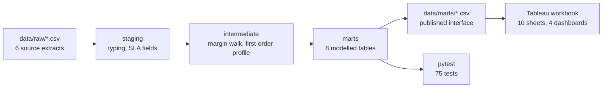

# Retail Margin & Fulfilment Intelligence

A reproducible analytics project for a mid-size omnichannel retailer, modelled end to end
from source-system extracts into a Tableau workbook that answers the questions a trading
team actually argues about.

The premise is a complaint finance and operations share: **revenue reporting says the
business is growing, and the P&L disagrees.** The gap sits in costs that never appear next to
revenue in the source systems — discount, returns, freight subsidy, and acquisition spend.
This project puts them there.

```
£4.26M net revenue · £967k contribution margin · 22.7% margin rate · 85.6% on-time delivery
Electronics: 35.7% of revenue, 4.5% margin rate. Beauty: 5.5% of revenue, 53.9%.
```

Every number on a dashboard traces back to SQL you can read, and the accounting identities
behind them are enforced by tests. Nothing is hand-keyed.

---

## The questions it answers

| Question | Where |
| --- | --- |
| Which categories make money once returns and freight are charged to them? | Margin Reality |
| Is discounting buying volume, or giving away margin? | Pricing & Discounting |
| Which fulfilment centre and carrier lanes miss the promised delivery date? | Fulfilment & Its Cost |
| What does a bad first order cost in repeat purchase? | Fulfilment & Its Cost |
| Which acquisition channels pay back, and when? | Acquisition & Returns |
| Which return reasons destroy the most margin, as opposed to the most units? | Acquisition & Returns |

Full scope and out-of-scope decisions: [docs/business_questions.md](docs/business_questions.md).

## What it found

- **Electronics is 35.7% of revenue and 7% of contribution margin.** Ranked by revenue it is
  the biggest category; ranked by margin it is nearly the smallest. Beauty, at 5.5% of
  revenue, earns almost twice as much margin.
- **Discounting Electronics past 10% destroyed £62k of margin** — against £68k the category
  earned in total — while moving units per line from 1.23 to just 1.29. Apparel, by contrast,
  responds to depth well enough to justify it.
- **One lane carries 41% of all revenue on late parcels.** FC-South via Regional Freight
  delivers on time 69.4% of the time against 94.7% on the best lane.
- **A late first delivery costs 16.8 points of repeat rate** — 27.9% against 44.7% for a clean
  first order. That is what turns the lane above from an operations problem into a commercial
  one.
- **Affiliate returns 1.8× its acquisition cost after twelve months**; Organic returns 38×.
- **Damaged and faulty returns are 20% of returns and 42% of the margin lost**, because those
  units cannot be restocked.

Full write-up, caveats and recommendations: [docs/analysis_notes.md](docs/analysis_notes.md).

## Architecture



Raw extracts are committed, so a clone can open the workbook immediately. The DuckDB file is
a build artifact and is not committed — `src/build_marts.py` recreates it in about a second.

### Layout

```
data/raw/           six source extracts, generated and committed
data/marts/         the published interface the workbook reads
src/
  generate_raw_data.py   seeded, stdlib-only source data generator
  build_marts.py         raw -> staging -> intermediate -> marts, then CSV export
  sql/staging/           typing, cleaning, delivery SLA fields
  sql/intermediate/      the margin walk and the first-order profile
  sql/marts/             eight published tables
tableau/            the workbook
  schema/                Tableau's published workbook schema, vendored for validation
tools/              workbook generator
tests/              contract, reproducibility, workbook-integrity and schema tests
docs/               questions, metric definitions, data dictionary, dashboard guide, findings
```

## Running it

```bash
pip install -r requirements.txt
python src/build_marts.py
pytest -q
```

Then open `tableau/retail_margin_intelligence.twb` in **Tableau Desktop or Tableau Public
2026.1 or later**. It connects to `data/marts/*.csv` by relative path, so no configuration is
needed. The workbook uses the 2026.1 document format, so earlier versions will not open it.

To regenerate the source extracts from scratch (they are deterministic, so this reproduces
the committed files byte for byte):

```bash
python src/generate_raw_data.py
```

## How the numbers are kept honest

The claim that every dashboard figure is auditable is enforced, not asserted. `pytest` runs
75 tests. The 54 data contract tests fall into four groups:

- **Shape** — every mart exists, has rows, and has a unique non-null key.
- **Integrity** — foreign keys resolve, returned quantities never exceed ordered ones, dates
  are ordered, cohort denominators are fixed, cohort grids are dense, and store-collected
  orders never enter the on-time denominator.
- **Identity** — contribution margin equals realised revenue less cost of goods less net
  freight; freight allocated across order lines reconciles to the order header; cost of goods
  is only recovered on restocked returns.
- **Agreement** — marts that report the same total actually report the same total.
  `fct_order_items`, `dim_product`, `dim_customer` and `fct_discount_bands` are checked
  against each other.

Two further tests prove the committed data is exactly what the committed code produces:
regenerating the raw extracts and rebuilding the marts must both be byte-identical. That is
also why money columns are exact `DECIMAL` rather than `DOUBLE` — DuckDB's parallel
aggregation reorders float addition, which changed the last rounded digit between runs.

`tests/test_workbook_integrity.py` validates the Tableau workbook without Tableau installed:
every connection resolves to a mart that exists, every column ordinal matches the CSV header,
every calculated field references a real field, every pill on a shelf was declared, and every
dashboard zone points at a real sheet. It catches the renamed-column-leaves-a-dead-reference
failure that otherwise shows up as a red pill weeks later.

`tests/test_workbook_schema.py` validates the workbook against
[Tableau's published schema](https://github.com/tableau/tableau-document-schemas) for the
2026.1 format, vendored in `tableau/schema/`. The two workbook test files are complementary:
Tableau's schema checks structure but not references between parts of a workbook, which is
exactly what the integrity tests check. Neither proves the workbook opens — Tableau's only check
for that is a Tableau Cloud or Server endpoint — but together they rule out the ways a generated
workbook is usually broken.

CI runs the whole thing on every push — rebuilding the data, regenerating the workbook, and
running the tests — and fails if a rebuild changes anything committed.

## Notes on the data

The dataset is synthetic and generated by `src/generate_raw_data.py`, which is stdlib-only and
seeded. It is not uniform noise: the generator encodes the behaviours the analysis is meant to
find — category-level return rates and margins, discount response that differs by category,
on-time rates that depend on the centre-carrier pairing and degrade in the peak, a repeat-rate
penalty after a late or returned first order, and acquisition channels that differ in both
cost and quality. Nothing downstream is told about any of it; the marts have to surface it
from the rows.

The structure and the relationships are realistic and the pipeline is production-shaped, but
the numbers describe a business that does not exist.

## Documentation

- [Business questions](docs/business_questions.md) — scope, grain, and what is deliberately out
- [Metric definitions](docs/metric_definitions.md) — the margin walk, allocation and attribution rules
- [Data dictionary](docs/data_dictionary.md) — every raw extract and published mart
- [Dashboard guide](docs/dashboard_guide.md) — what each sheet shows and how to read it
- [Analysis notes](docs/analysis_notes.md) — findings, recommendations, caveats
